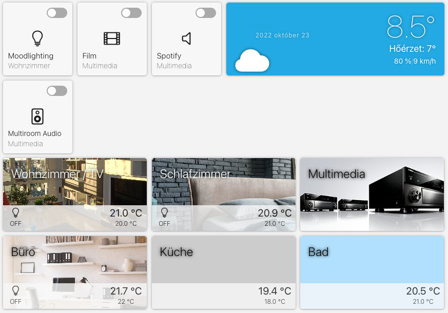
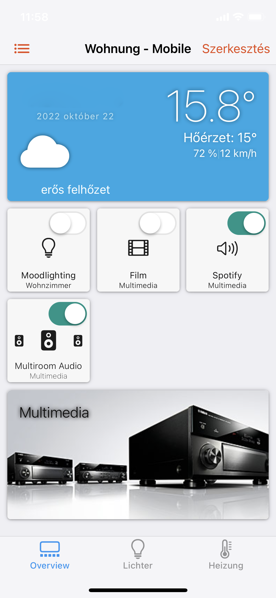

# openhab-widgets
Some openHab widgets for the new grid layout

to use these widget, just create a new widget in the developer menu and copy the content of the file (overwrite the generated content) to the widget and save it. Then you can use in the grid layout pages.

### **Widget to display room information**
This widget show the main information of a room, either with a picture or with a coloured background

gw_RoomWidget.txt (tablet version)
gwm_RoomWidget.txt (mobile version)

### **Compact button**
Compact button designed for tablet and mobile

gw_CompButton.txt (tablet version)
gwm_CompButton.txt (mobile version)

### **Compact button with dimmer**
Compact button designed for tablet and mobile with additional dimming slider. very practical to combine with hue dimmer

gw_CompDimButton.txt (tablet version)
gwm_CompDimButton.txt (mobile version)

### **Thermostat**
Compact thermostat which shows the measured value and able to define new setpoints

gw_CompThermostat.txt (tablet version)
gwm_CompThermostat.txt (mobile version)

### **Multiroom Audio**
Multiroom audio is able to control two audio volumes, with master and satellite speakers

gw_CompThermostat.txt (tablet version)
gwm_CompThermostat.txt (mobile version)

### **Sidebar for tablet screens**
gw_SideBar.txt

### **Label bar for tablet screens**
gw_Label.txt

### **Examples for tablet and mobile screens**

